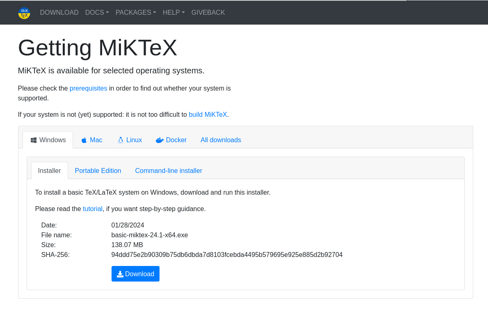
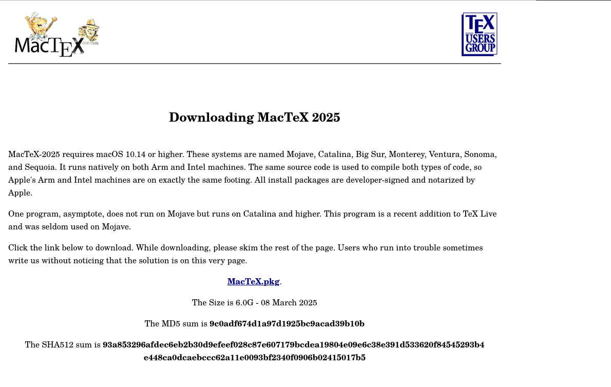
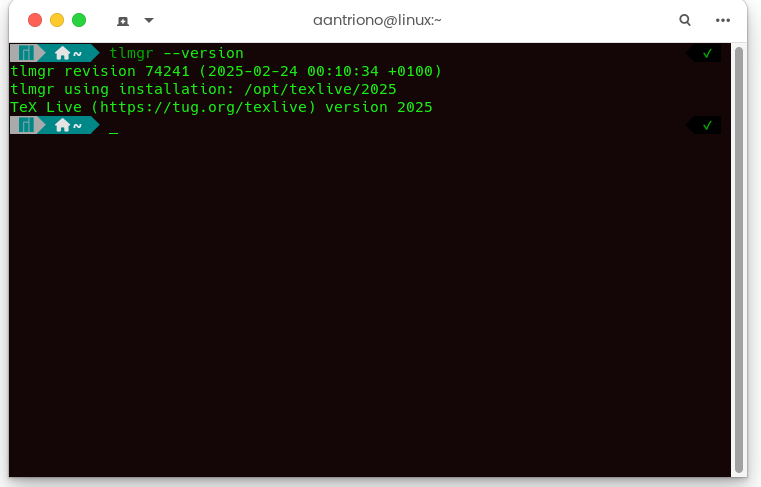

Artikel ini membahas tentang cara instal mesin LaTeX, yaitu: MikTeX, MacteX, dan TeXlive di berbagai platform sistem operasi seperti Windows, Mac OS, dan Linux.

<!--more-->



Untuk mempelajari LaTeX secara lebih mendalam, silakan kunjungi [Panduan Belajar LaTeX](https://www.aantriono.com/2022/07/buku-panduan-belajar-latex.html)




#  Panduan Lengkap Instalasi LaTeX: MikTeX, MacTeX, dan TeXLive untuk Semua Platform

## Pendahuluan

LaTeX adalah sistem persiapan dokumen yang powerful untuk menghasilkan dokumen berkualitas tinggi, terutama untuk dokumen yang mengandung formula matematika, referensi ilmiah, dan struktur kompleks. Untuk menggunakan LaTeX, Anda memerlukan distribusi TeX. Artikel ini akan membahas tiga distribusi utama: **MikTeX** (Windows), **MacTeX** (macOS), dan **TeXLive** (cross-platform).

---

## Apa itu Distribusi LaTeX?

Distribusi LaTeX adalah paket lengkap yang berisi:
- **TeX engine** (pdfTeX, XeTeX, LuaTeX)
- **Package manager** untuk mengelola paket LaTeX
- **Font dan style files**
- **Compiler** untuk mengkonversi file .tex menjadi PDF
- **Editor** (opsional) untuk menulis kode LaTeX

---

## Perbandingan MikTeX, MacTeX, dan TeXLive

| **Kriteria** | **MikTeX** | **MacTeX** | **TeXLive** |
|---|---|---|---|
| **Platform** | Windows (utama), Linux, macOS | macOS (khusus) | Windows, macOS, Linux |
| **Ukuran Download** | ~200 MB (basic) | ~4 GB (full) | ~4 GB (full) |
| **Instalasi** | Modular (install on-demand) | Full installation | Full atau custom |
| **Package Manager** | MikTeX Console (GUI) | TeX Live Utility | tlmgr (command-line) |
| **Update Frequency** | Frequent | Yearly (dengan updates) | Yearly |
| **Kemudahan Penggunaan** | Sangat mudah (5/5) | Mudah (4/5) | Medium (3/5) |
| **Auto-install Packages** | Ya (default) | Tidak | Ya (dapat dikonfigurasi) |
| **IDE Bawaan** | TeXworks | TeXShop | TeXworks (Windows) |
| **Ukuran Instalasi** | 1-4 GB (tergantung) | ~7 GB | 5-7 GB |
| **Lisensi** | Open source | Open source | Open source |
| **Komunitas** | Besar | Medium (fokus Mac) | Sangat besar |
| **Kecepatan Kompilasi** | Cepat | Cepat | Cepat |
| **Rekomendasi Untuk** | Windows users, pemula | macOS users | Advanced users, Linux |

---

## Instalasi MikTeX di Windows

### Langkah 1: Download MikTeX



1. Kunjungi website resmi: [https://miktex.org/download](https://miktex.org/download)
2. Pilih **"Download"** untuk Windows
3. Pilih installer (Recommended: **MikTeX-pdfTeX Installer**)
4. Ukuran download: ±200 MB

### Langkah 2: Jalankan Installer

1. Double-click file installer yang telah didownload
2. Pilih **"Install MikTeX for all users"** atau **"Install just for me"**
   - *Rekomendasi: Install just for me (tidak butuh admin)*
3. Klik **"Next"**

### Langkah 3: Konfigurasi Instalasi

1. **Direktori Instalasi**: Biarkan default atau pilih folder lain
2. **Settings**:
   - **Install missing packages on-the-fly**: Pilih **"Yes"** (sangat direkomendasikan)
   - **Paper size**: A4 (untuk Indonesia/Eropa) atau Letter (untuk US)
3. Klik **"Start"** untuk memulai instalasi

### Langkah 4: Verifikasi Instalasi

Buka **Command Prompt** atau **PowerShell** dan jalankan:

```bash
pdflatex --version
```

Output yang diharapkan:
```
MiKTeX-pdfTeX 4.x (MiKTeX 23.x)
```

### Langkah 5: Update Packages (Opsional)

1. Buka **MikTeX Console** dari Start Menu
2. Klik **"Updates"** di sidebar
3. Klik **"Check for updates"**
4. Klik **"Update now"** jika ada update tersedia

---

## Instalasi MacTeX di macOS

### Langkah 1: Download MacTeX



1. Kunjungi: [https://www.tug.org/mactex/](https://www.tug.org/mactex/)
2. Download **MacTeX.pkg** (±4 GB)
3. Alternatif: Gunakan **BasicTeX** (±100 MB) untuk instalasi minimal

### Langkah 2: Instalasi

1. Double-click file **MacTeX.pkg**
2. Ikuti wizard instalasi standar macOS
3. Klik **"Continue"** → **"Install"**
4. Masukkan password administrator Mac Anda
5. Proses instalasi membutuhkan waktu 10-20 menit

### Langkah 3: Verifikasi Instalasi

Buka **Terminal** dan jalankan:

```bash
pdflatex --version
```

Output yang diharapkan:
```
pdfTeX 3.x.x (TeX Live 2024)
```

### Langkah 4: Update Packages

Buka **TeX Live Utility** dari Applications:

1. Klik **"Update All Packages"**
2. Tunggu hingga proses selesai

### Langkah 5: Gunakan TeXShop (Editor Bawaan)

- **TeXShop** otomatis terinstall bersama MacTeX
- Buka dari **Applications/TeX/**
- IDE yang user-friendly khusus untuk macOS

---

## Instalasi TeXLive di Linux

### Metode 1: Instalasi via Package Manager (Recommended untuk Pemula)

#### Untuk Ubuntu/Debian:

```bash
sudo apt update
sudo apt install texlive-full
```

**Catatan**: 
- `texlive-full` akan menginstall semua paket (~5 GB)
- Untuk instalasi minimal: `sudo apt install texlive`

#### Untuk Fedora/RHEL:

```bash
sudo dnf install texlive-scheme-full
```

#### Untuk Arch Linux:

```bash
sudo pacman -S texlive-most
```

### Metode 2: Instalasi Manual (Recommended untuk Advanced Users)

#### Langkah 1: Download Installer

```bash
wget https://mirror.ctan.org/systems/texlive/tlnet/install-tl-unx.tar.gz
tar -xzf install-tl-unx.tar.gz
cd install-tl-*/
```

#### Langkah 2: Jalankan Installer

```bash
sudo perl install-tl
```

#### Langkah 3: Pilih Opsi Instalasi

- Tekan **"I"** untuk memulai instalasi
- Atau tekan **"C"** untuk kustomisasi (pilih scheme, collections, dll)

#### Langkah 4: Set Environment Variables

Tambahkan ke `~/.bashrc` atau `~/.zshrc`:

```bash
export PATH=/usr/local/texlive/2024/bin/x86_64-linux:$PATH
export MANPATH=/usr/local/texlive/2024/texmf-dist/doc/man:$MANPATH
export INFOPATH=/usr/local/texlive/2024/texmf-dist/doc/info:$INFOPATH
```

Reload shell:
```bash
source ~/.bashrc
```

### Langkah 5: Verifikasi Instalasi

```bash
pdflatex --version
tlmgr --version
```

### Langkah 6: Update TeXLive

```bash
sudo tlmgr update --self
sudo tlmgr update --all
```

---

## Instalasi TeXLive di Windows (Alternatif MikTeX)

### Langkah 1: Download Installer

1. Kunjungi: [https://www.tug.org/texlive/acquire-netinstall.html](https://www.tug.org/texlive/acquire-netinstall.html)
2. Download **install-tl-windows.exe**

### Langkah 2: Jalankan Installer

1. Double-click installer
2. Pilih **"Install"** (untuk instalasi penuh)
3. Atau pilih **"Advanced"** untuk custom installation

### Langkah 3: Konfigurasi

- **Installation Directory**: Biarkan default (`C:\texlive\2024`)
- **Scheme**: Pilih "full scheme" untuk instalasi lengkap
- Klik **"Install TeX Live"**

### Langkah 4: Verifikasi

```cmd
pdflatex --version
```

---

## Instalasi Editor LaTeX (Opsional tapi Direkomendasikan)

Setelah menginstall distribusi LaTeX, Anda membutuhkan editor untuk menulis kode. Berikut pilihan populer:

### 1. TeXstudio (Cross-platform) - Recommended

- **Download**: [https://www.texstudio.org/](https://www.texstudio.org/)
- **Fitur**: Auto-completion, syntax highlighting, integrated PDF viewer
- **Platform**: Windows, macOS, Linux

### 2. Overleaf (Online)

- **Website**: [https://www.overleaf.com/](https://www.overleaf.com/)
- **Keuntungan**: Tidak perlu instalasi, kolaborasi real-time
- **Kelemahan**: Membutuhkan internet

### 3. VS Code + LaTeX Workshop

- Install VS Code
- Install extension: **LaTeX Workshop**
- Konfigurasi otomatis dengan MikTeX/TeXLive

### 4. TeXworks (Simple)

- Sudah terinstall dengan MikTeX dan TeXLive
- User-friendly untuk pemula

### 5. LyX (WYSIWYM Editor)

- Visual editor seperti Word
- **Download**: [https://www.lyx.org/](https://www.lyx.org/)

---

## Test Instalasi dengan Dokumen Sederhana

Buat file bernama `test.tex` dengan isi:

```latex
\documentclass{article}
\usepackage[utf8]{inputenc}
\usepackage[bahasa]{babel}

\title{Test Dokumen LaTeX}
\author{Nama Anda}
\date{\today}

\begin{document}

\maketitle

\section{Pendahuluan}
Ini adalah dokumen LaTeX pertama saya.

\section{Matematika}
Rumus Pythagoras: $a^2 + b^2 = c^2$

Integral:
\[
\int_0^\infty e^{-x^2} dx = \frac{\sqrt{\pi}}{2}
\]

\end{document}
```

### Compile Dokumen:

**Via Command Line:**
```bash
pdflatex test.tex
```

**Via Editor:**
- Buka file di TeXstudio/TeXworks
- Tekan **F5** atau klik tombol **"Build & View"**

Jika berhasil, akan muncul file `test.pdf`.

---

## Troubleshooting Umum

### 1. Package tidak ditemukan

**MikTeX:**
- Pastikan setting "Install missing packages on-the-fly" aktif di MikTeX Console

**TeXLive:**
```bash
sudo tlmgr install <nama-package>
```

### 2. Command tidak ditemukan

- Periksa apakah PATH sudah diset dengan benar
- Restart terminal/command prompt
- Di Windows: Cek Environment Variables

### 3. Font error

```bash
# Update font cache di Linux
sudo fc-cache -fv

# Di Windows, reinstall MikTeX
```

### 4. Compilation error

- Periksa log file (`.log`)
- Pastikan syntax LaTeX benar
- Install package yang kurang

---

## Tips dan Rekomendasi

### Untuk Pemula:
- **Windows**: Gunakan **MikTeX** dengan **TeXstudio**
- **macOS**: Gunakan **MacTeX** dengan **TeXShop**
- **Linux**: Gunakan **TeXLive** via package manager

### Untuk Advanced Users:
- Gunakan **TeXLive** (cross-platform consistency)
- Editor: **VS Code** dengan **LaTeX Workshop**
- Version control: Simpan proyek LaTeX di Git

### Untuk Kolaborasi:
- Gunakan **Overleaf** (online)
- Atau gunakan Git + TeXLive

### Maintenance:
- Update packages secara berkala (bulanan)
- Hapus file auxiliary (`.aux`, `.log`) setelah compile
- Backup template dan custom packages

---

## Resource Tambahan

- **LaTeX Documentation**: [https://www.latex-project.org/](https://www.latex-project.org/)
- **CTAN (Package Repository)**: [https://ctan.org/](https://ctan.org/)
- **LaTeX Wikibook**: [https://en.wikibooks.org/wiki/LaTeX](https://en.wikibooks.org/wiki/LaTeX)
- **TeXLive Documentation**: [https://www.tug.org/texlive/doc.html](https://www.tug.org/texlive/doc.html)
- **Stack Exchange (TeX)**: [https://tex.stackexchange.com/](https://tex.stackexchange.com/)

---

## Kesimpulan

Memilih distribusi LaTeX tergantung pada sistem operasi dan kebutuhan Anda:

- **MikTeX**: Terbaik untuk Windows, mudah digunakan, instalasi modular
- **MacTeX**: Pilihan utama untuk macOS, terintegrasi sempurna dengan sistem
- **TeXLive**: Cross-platform, konsisten, cocok untuk semua platform

Ketiga distribusi ini gratis, open-source, dan powerful. Setelah instalasi, Anda siap membuat dokumen akademis, buku, presentasi, dan publikasi ilmiah berkualitas tinggi dengan LaTeX!

---

**Selamat menulis dengan LaTeX!**
